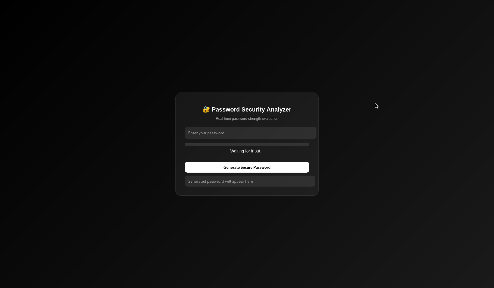

---

<!-- ===================== -->

<!-- 💜 PASSWORD SECURITY LAB -->

<!-- ===================== -->


<p align="center">
  
</p>


## 💀 SYSTEM BOOT

```bash
[ SYSTEM ] booting security module...
[ LOAD   ] password analyzer
[ LOAD   ] dictionary scanner
[ LOAD   ] generator engine
[ STATUS ] READY
```


## ⚙️ HOW TO RUN

```bash
pip install -r requirements.txt
python app.py
```

🌐 Open:

```
http://127.0.0.1:5000
```


## 🔐 FEATURES

✔ password strength analysis
✔ dictionary attack detection
✔ entropy scoring engine
✔ secure password generator
✔ real-time UI updates


## 🧪 HOW IT WORKS

```bash
INPUT → user password
STEP 1 → length analysis
STEP 2 → character scan
STEP 3 → entropy calculation
STEP 4 → dictionary check
STEP 5 → final score output
```


## 📊 LEVEL SYSTEM

```
0–39   → WEAK
40–69  → MEDIUM
70–100 → STRONG
```


## 💀 DICTIONARY CHECK

```bash
"123456"  → BLOCKED
"password" → BLOCKED
"qwerty"   → BLOCKED
```


## 🎲 PASSWORD GENERATOR

```bash
[a-z][A-Z][0-9][symbols]
length: 12–16
mode: secure random
```


## 📸 INTERFACE

<p align="center">
  
</p>


## 🛡️ SECURITY NOTES

* no password storage
* no logging
* local execution only
* fast API response (<100ms)


## 🚀 INSTALLATION (GIT CLONE)

```bash
git clone YOUR_REPO
cd password-security-lab

pip install -r requirements.txt
python app.py
```


## 🧬 TECH STACK

```bash
> Python
> Flask
> Security Algorithms
> Entropy Math
> UI Real-time Updates
```


## 👤 FOOTER

👤 unicorn
🐙 github profile - unicorn-rm
🧠 cybersecurity / dev / tools

---

💜 READY FOR SECURITY TESTING.
